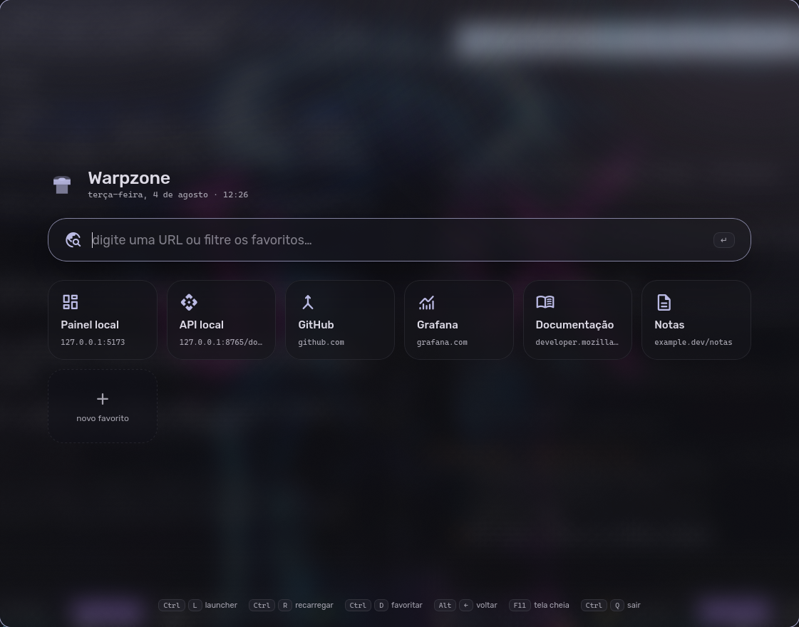
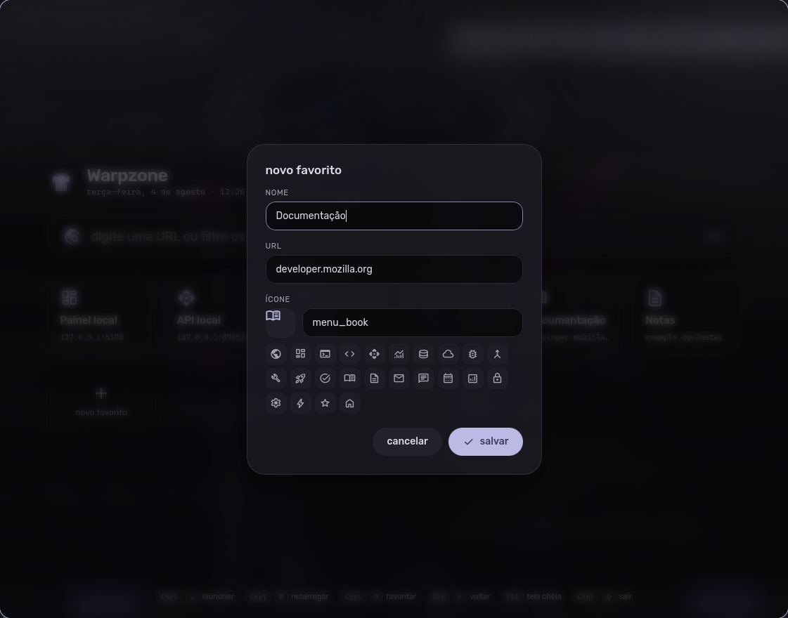

<div align="center">


# Warpzone

Abre qualquer URL como aplicativo desktop: uma janela, sem abas,
sem barra de endereço, sem menu.

[](#requisitos)
[](#requisitos)
[](#arquitetura)
[](#requisitos)
[](#desenvolvimento)
[](LICENSE)



</div>

---

## Recursos

- **Janela sem cromo.** Sem abas, barra de endereço ou menu — a janela inteira é o conteúdo.
- **Launcher com favoritos.** Campo de URL com filtro ao vivo e grade de atalhos, editável na própria tela.
- **Tema dinâmico.** As cores são lidas do esquema do [Caelestia](https://github.com/caelestia-dots/shell) em tempo de execução.
- **Transparência real.** A janela tem canal alfa; o desfoque é do compositor, não CSS.
- **Navegação por teclado.** Todas as ações têm atalho; não há controles de navegação na tela.
- **Sessão persistente.** Cookies e `localStorage` sobrevivem ao fechamento.
- **Diagnóstico de falha.** Numa URL local que não responde, identifica a unit `systemd` parada e mostra o comando para subir.

## Requisitos

Todas as dependências vêm dos repositórios da distribuição. Nenhum pacote Python é instalado.

```sh
# Arch / CachyOS
sudo pacman -S --needed python-gobject gtk3 webkit2gtk-4.1

# Debian / Ubuntu
sudo apt install python3-gi gir1.2-webkit2-4.1
```

O instalador verifica esses pré-requisitos e aborta indicando o que falta.

**Opcionais:** as fontes `Rubik`, `Material Symbols Rounded` e `CaskaydiaCove NF`. Sem elas a
aplicação recorre às fontes do sistema e os ícones são exibidos como texto. O desfoque depende do
compositor (Hyprland, KWin e equivalentes); onde não houver, a janela apenas fica mais opaca.

## Instalação

```sh
git clone git@github.com:LuisMarchio03/warpzone.git
cd warpzone
sh packaging/install.sh
```

Instala `~/.local/bin/warpzone` e a entrada **Warpzone** no menu de aplicativos. Não requer `sudo`
e não escreve fora de `$HOME`.

O executável instalado referencia o diretório clonado em vez de copiar o código: alterações no
repositório valem na próxima abertura, sem reinstalar.

| Comando | Efeito |
|:---|:---|
| `sh packaging/install.sh` | instala e abre uma vez para verificação |
| `sh packaging/install.sh --no-abrir` | instala sem abrir |
| `sh packaging/uninstall.sh` | remove a aplicação, preserva favoritos e cookies |
| `sh packaging/uninstall.sh --tudo` | remove também os dados do usuário |

## Uso

```sh
warpzone                        # abre o launcher
warpzone localhost:5173         # abre a URL, completando o esquema http://
warpzone grafana.exemplo.dev    # abre a URL, completando o esquema https://
```

O launcher também é acessível pela entrada **Warpzone** no menu de aplicativos.

No campo de URL, digitar filtra os favoritos em tempo real. `Enter` abre o primeiro resultado do
filtro ou navega diretamente, quando o texto tem forma de endereço.

### Atalhos

| Tecla | Ação |
|:---|:---|
| `Ctrl` `L` | retorna ao launcher |
| `Ctrl` `R` | recarrega a página; no launcher, redesenha |
| `Ctrl` `D` | adiciona a página atual aos favoritos |
| `Alt` `←` / `Alt` `→` | histórico; a partir do launcher, retoma o último site |
| `F11` | tela cheia |
| `Ctrl` `Shift` `I` | inspetor do WebKit |
| `Ctrl` `Q` | encerra |
| `Esc` | limpa o filtro ou fecha o formulário |

### Atalho global

A instalação não registra atalho de teclado. Para vincular um, no Hyprland:

```conf
# ~/.config/hypr/hyprland.conf (ou o arquivo de override da sua config)
bind = SUPER SHIFT, W, exec, warpzone
```

```sh
hyprctl reload
hyprctl binds | grep -A3 'key: W'    # confirma que o bind foi registrado
```

Variações úteis:

```conf
bind = SUPER SHIFT, W, exec, warpzone http://127.0.0.1:5173   # abre sempre a mesma URL
bind = SUPER SHIFT, W, exec, pkill -x warpzone || warpzone    # alterna abrir/fechar
```

O `exec` do compositor usa o `PATH` do processo do Hyprland, não o do seu shell. Se
`~/.local/bin` não estiver nele, use o caminho absoluto do executável.

### Favoritos



O card **+ novo favorito** abre o formulário de cadastro, com três campos:

- **nome** — rótulo exibido no card
- **URL** — o esquema é opcional; `localhost:3000` é normalizado para `http://localhost:3000`
- **ícone** — qualquer glifo do [Material Symbols Rounded](https://fonts.google.com/icons), com 24 sugestões e pré-visualização

O ícone de lápis edita o favorito; o × remove. As alterações são gravadas imediatamente em
`~/.config/warpzone/bookmarks.json`, que também pode ser editado manualmente:

```json
[
  { "nome": "Painel", "url": "http://127.0.0.1:5173", "icone": "dashboard" }
]
```

<br clear="right">

## Arquitetura

Uma janela GTK3 sem decoração contendo um único `WebKit2.WebView`, alternando entre dois estados:
o launcher (HTML local, carregado via `load_html`) e o site (URL remota). A comunicação entre
JavaScript e Python usa `window.webkit.messageHandlers`.

```
warpzone/
├── app.py             janela, atalhos, ponte JS↔Python
├── __main__.py        entrada de linha de comando
├── urls.py            normalização de entrada para URL navegável
├── scheme.py          esquema do Caelestia → CSS custom properties
├── bookmarks.py       persistência dos favoritos
├── session.py         persistência de cookies do WebKit
├── services.py        detecção de unit systemd parada
├── launcher_page.py   composição de HTML, CSS, JS e dados numa página
└── launcher/          index.html · style.css · app.js · error.html
```

Toda a lógica de domínio fica fora de `app.py`, de modo que a suíte de testes executa sem abrir
uma janela.

### Notas de implementação

1. `load_html()` descarta o histórico do `WebView` e define a URI como `about:blank`. O estado de
   navegação (`_no_launcher`, `_ultima_uri`) é mantido pela aplicação em vez de consultado ao WebKit.
2. Sem `set_background_color(alpha=0)` o WebKit desenha um fundo opaco abaixo do CSS, anulando a
   transparência da janela.
3. A opacidade do véu do launcher fica em 55%. Valores acima disso tornam o desfoque do compositor
   visualmente imperceptível.

### Arquivos em disco

| Caminho | Conteúdo |
|:---|:---|
| `~/.config/warpzone/bookmarks.json` | favoritos |
| `~/.local/share/warpzone/` | cookies e `localStorage` do WebKit |
| `~/.local/state/caelestia/scheme.json` | origem das cores (somente leitura) |

## Desenvolvimento

```sh
uv venv --python /usr/bin/python3 --system-site-packages .venv
uv pip install --python .venv/bin/python pytest
.venv/bin/pytest
```

O parâmetro `--python /usr/bin/python3` é obrigatório: sem ele o `uv` provisiona um interpretador
próprio e o módulo `gi`, instalado como pacote do sistema, não fica acessível.

`app.py` não possui testes automatizados por depender de GTK; é validado por verificação manual.
Os atalhos podem ser acionados programaticamente:

```sh
hyprctl dispatch sendshortcut "CTRL,L,class:^(warpzone)$"
```

## Licença

MIT — consulte [LICENSE](LICENSE).
